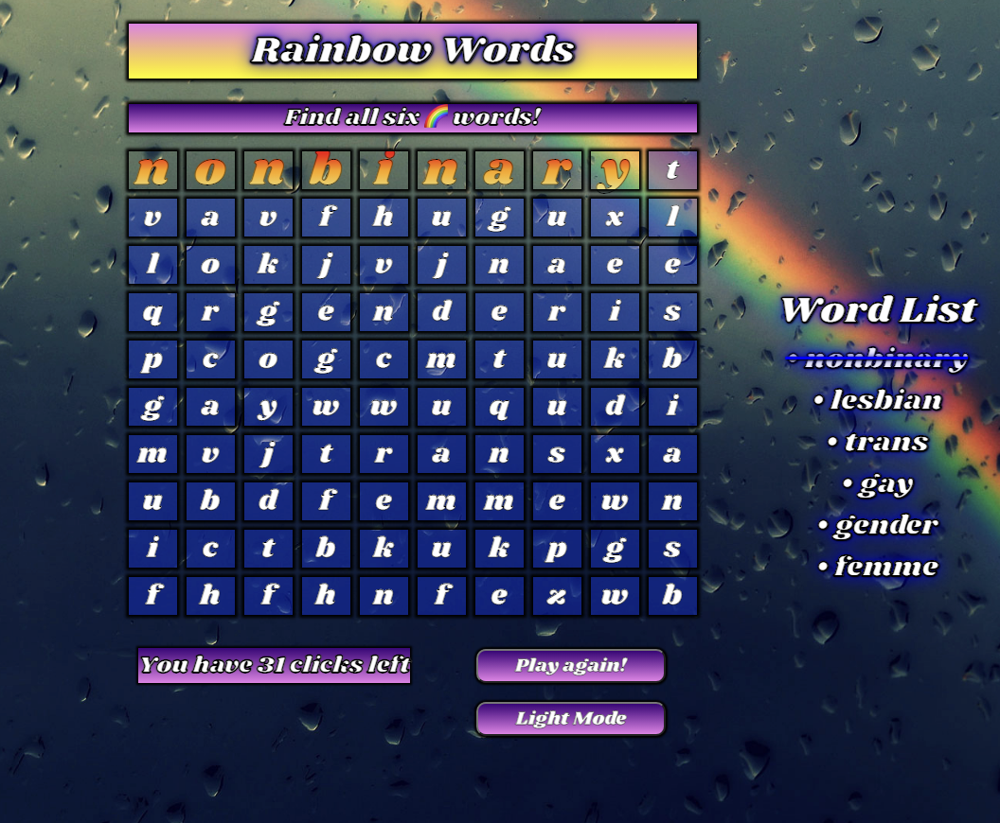

# Rainbow Words
## 
## [Play Rainbow Words](https://rainbowwords.netlify.app/)
## Getting Started
Rainbow Words was created due to the lack of LGBT game content and to promote LGBT visibility.  The gameplay is as follows:
* Player is given a board of letters and a list of words to find.
* Player has 40 clicks to find all the words.
* As the player finds each word, the word is crossed off from the list.
* Player wins a gold trophy if all the words are found in 35 turns, a silver trophy if all the words are found in 36 turns, or a bronze trophy if all the words are found in 37-40 turns.
* "Born This Way" by Lady Gaga is played.
* If the player does not find all the words in 40 turns, the player loses the game.  The player wins a photograph of trophies.
* "Photograph" by Nickelback is played.
* Player can press play again to reset.
* Planning materials can be found [here.](./pseudo.txt)
## Attributions
* [MDN](https://www.w3schools.com/)
* [W3Schools](https://www.w3schools.com/)
* [Iconduck](https://iconduck.com/emojis/44328/rainbow)
* [Wallpaperaccess](https://wallpaperaccess.com/rainbow-rain)
* [Wallpaper Safari](https://wallpapersafari.com/rainbow-clouds-wallpaper/)
* [Vecteezy](https://www.vecteezy.com/vector-art/11264507-winner-trophy-icon-gold-silver-bronze-cartoon-trophy-vector-illustration)
* [Google Fonts](https://fonts.googleapis.com/css2?family=Shrikhand&display=swa)
* ["Born this Way" by Lady Gaga](https://www.youtube.com/watch?v=3Vzrr64ZrVU)
* ["Photograph" by Nickelback](https://www.youtube.com/watch?v=IcDnVaYOsig)
* [Animate.CSS](https://animate.style/#attention_seekers)
## Technologies Used
* HTML
* CSS
* JavaScript
* Git
## Next Steps
* Multiple word searches in a data folder that can be imported and exported into the js/app.js file
* A suggestion box for the player to suggest words for future word searches
* Easy, Medium, and Hard word searches with overlapping words
* The word search starts at the top of the screen and moves down faster and faster as time goes by
* A timer for the word search